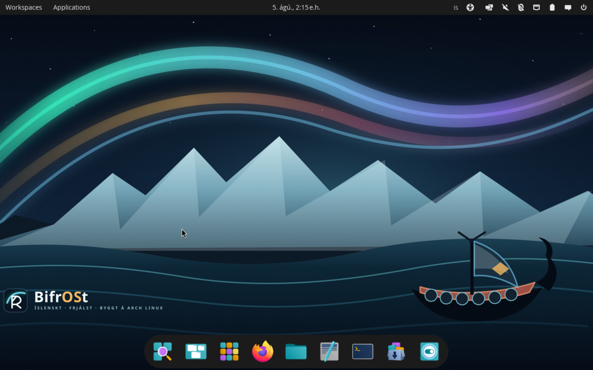
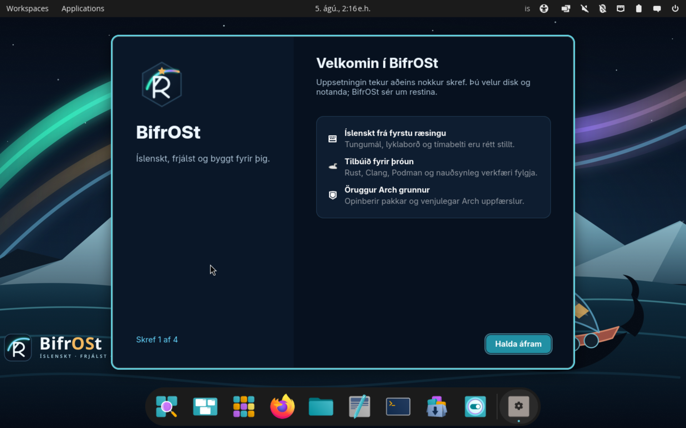
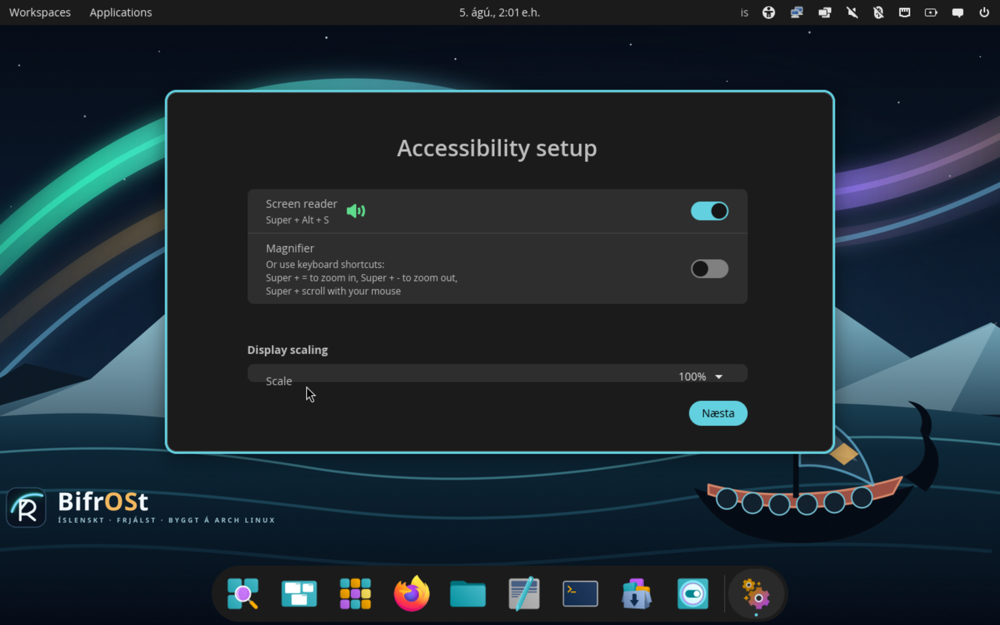

<p align="center">
  
</p>

<h1 align="center">BifrOSt</h1>

<p align="center"><strong>Íslenskt · frjálst · byggt á Arch Linux</strong></p>

BifrOSt is an independent, Icelandic-first developer workstation and live/install ISO based on Arch Linux. It keeps Arch's official kernel, `pacman`, repositories, and rolling-release update model, while adding Icelandic defaults, COSMIC, optional development profiles, and an original visual identity.

> ## AÐVÖRUN — VALINN DISKUR EYÐIST
>
> BifrOSt 0.2.1 setur aðeins upp á **heilan disk**. Öll disksneiðing og öll gögn á staðfesta markdiskinum verða fjarlægð. Taktu sannreynt afrit og aftengdu diska sem ekki má eyða.
>
> ## WARNING — THE SELECTED DISK WILL BE ERASED
>
> BifrOSt 0.2.1 performs a **whole-disk installation only**. Every partition and all data on the confirmed target are removed. Make a verified backup and disconnect disks that must not be erased. There is no dual-boot or manual-partitioning path.


## 0.2.1 release status

The source version is **0.2.1**. This release does not claim physical-hardware qualification, offline completeness, bit-for-bit reproducibility, operating-system rollback, or Secure Boot support. Artifact signing and installed provenance are claimed only where the release record and independently verified signatures document them.

- Installation requires x86_64 UEFI with Secure Boot disabled.
- Online installation from signed official Arch repositories is the normal mode.
- Offline mode is shown only when the medium contains a complete signed schema-v2 local source manifest, trusted keyring/repository, and all required package archives, and that source passes pre-wipe validation. A bootable ISO alone is not an offline-completeness claim.
- The `0.2.1` release-evidence key is tracked at [`keys/bifrost-release-key.asc`](keys/bifrost-release-key.asc). Its primary fingerprint is `A306 D353 7F15 3830 6CB3 A23B 2C4A 6276 8746 EFB6`; authenticate that fingerprint through an independent trusted channel before treating a checksum signature as publisher authentication. Unsigned artifacts are labeled `.unsigned`.
- Physical support is limited to explicit Pass entries in the release's [hardware qualification record](docs/hardware-qualification.md). One user-reported `0.2.0` physical run is recorded as Partial; no full physical-hardware Pass is claimed without the tested ISO digest and completed checklist.

## Whole-disk safety

The installer shows and freezes the target's current path, model, capacity, serial number, WWN when available, and sector geometry. The UI requires a non-removable target of at least 20 GiB; the backend independently refuses layouts below 16 GiB. It rejects detected live-media ancestry, mounts, holders, swap, read-only/unsuitable media, and any identity or geometry change, then repeats source and target validation immediately before wiping.

Device paths can change. Never identify a disk by `/dev/sd…` or capacity alone. Compare the displayed model plus serial or WWN with the physical device or firmware inventory. The final styled confirmation names the disk again and requires the exact path displayed at that moment. Cancel if any fact differs.

Read [Installation and safety](docs/install-and-safety.md) before using the installer.

## What 0.2.1 provides

- Icelandic-first installer and desktop, with English available for critical installation, failure, and recovery messages
- Whole-disk GPT/Btrfs installation with UEFI systemd-boot
- Optional LUKS2 encryption for the root data; the EFI System Partition remains unencrypted
- A mandatory `base` profile plus optional `dev-rust`, `dev-containers`, `dev-web`, and `dev-python` profiles
- Pre-wipe target revalidation and package-source readiness checks
- Retained per-run diagnostics below `/var/log/bifrost-installer/`
- A per-user first-boot BifrOSt welcome that reports recorded encryption/profile choices
- Icelandic locale (`is_IS.UTF-8`), Icelandic keyboard defaults, and `Atlantic/Reykjavik` timezone
- COSMIC with original BifrOSt aurora, glacier, basalt, and longship artwork
- Linux and Linux LTS kernels, NetworkManager, and PipeWire from official Arch repositories
- A package-owned, signed `bifrost-system` payload updated from its narrowly scoped ALPM repository only through complete `pacman -Syu` transactions
- A signed, per-user Flatpak catalog and **BifrOSt Update Assistant** for first-party BifrOSt applications

BifrOSt does not replace `pacman`, ship a custom kernel, enable the AUR automatically, or freeze Arch's rolling package versions.

## BifrOSt application updates

Open **BifrOSt Update Assistant** from the application menu to install, update, or roll back first-party BifrOSt applications. The assistant trusts only the embedded release key and the pinned repository at `https://olibuijr.github.io/BifrOSt/flatpak/repo/`, accepts only `org.bifrost.*` application IDs, and installs applications per user through Flatpak. It does not update Arch Linux; continue to use a complete `sudo pacman -Syu` transaction for the operating system.

Rollback returns an application to the most recent different commit recorded before an assistant-managed update. It does not roll back application data, the operating system, or applications installed from other Flatpak remotes. The command-line interface is `bifrost-app-manager`; run it without arguments for the exact `list`, `install`, `update`, `update-all`, and `rollback` syntax.

Release operators dispatch one or more reviewed `.flatpak` bundles with the protected application-release key:

```bash
python3 dispatch-app-release.py \
  --bundle /absolute/path/to/org.bifrost.Example.flatpak \
  --gpg-key DC91F525DD69C4671E3D3712209E142C2589BD16 \
  --gpg-homedir ~/.local/share/bifrost-release-gnupg \
  --publish
```

The dispatcher hashes each input, rejects refs outside the `org.bifrost` namespace, stages rather than mutates the live repository, signs imported commits and repository metadata, then publishes `release/flatpak-repo/` plus `release/bifrost.flatpakrepo` to GitHub Pages. Run without `--publish` to validate and sign locally first. Protect the signing key and obtain the passphrase through the local pinentry prompt; never pass it on the command line.

## Signed BifrOSt system package

Fresh installations register the first-party installed-system payload as the `bifrost-system` Arch package. Its narrowly scoped `[bifrost]` repository is configured after the official Arch repositories, requires signed packages and repository databases, and is used only to upgrade the already-installed BifrOSt payload. Kernels, the base system, and other distribution packages remain owned and updated by the official Arch repositories. Apply system maintenance only as a complete `sudo pacman -Syu` transaction; BifrOSt does not support partial upgrades, automatic application, operating-system rollback, or Secure Boot.

Release operators use the tracked [`keys/bifrost-alpm-key.asc`](keys/bifrost-alpm-key.asc), its exact primary fingerprint `69D95C1EA4E97AB5FB9580AAFED54F3B9691E1C2`, and an isolated GnuPG home containing exactly the corresponding secret key. The tooling never generates or exports private keys. From the repository root, build and locally verify the signed package, signed database, and ISO bootstrap stage:

```bash
./generate-release-metadata.py \
  --prepare-installed profile/airootfs/usr/share/bifrost/installed-root/usr/share/bifrost/release.json \
  --source-revision "$FULL_COMMIT" \
  --source-date-epoch "$SOURCE_DATE_EPOCH"

python3 packaging/alpm/build-repository.py \
  --gpg-homedir /absolute/path/to/isolated-alpm-gnupg \
  --fingerprint 69D95C1EA4E97AB5FB9580AAFED54F3B9691E1C2 \
  --public-key keys/bifrost-alpm-key.asc

python3 packaging/alpm/publish-repository.py \
  --stage release/alpm/x86_64 \
  --fingerprint 69D95C1EA4E97AB5FB9580AAFED54F3B9691E1C2 \
  --public-key keys/bifrost-alpm-key.asc
```

The build reads the upstream package version from `VERSION` and the positive package-release revision from `packaging/bifrost-system/PKGBUILD`, packages the complete tracked `installed-root` payload plus installed branding/configuration while excluding interpreter caches, and stages the verified bootstrap inputs under the ArchISO profile. Publication is a separate explicit operation and repeats signature, fingerprint, checksum, package-name, package-version, and repository-boundary verification before changing GitHub Pages. It refuses to replace the published repository unless the candidate package version is strictly newer.

```bash
python3 packaging/alpm/publish-repository.py \
  --stage release/alpm/x86_64 \
  --fingerprint 69D95C1EA4E97AB5FB9580AAFED54F3B9691E1C2 \
  --public-key keys/bifrost-alpm-key.asc \
  --publish
```

This publishes only `alpm/x86_64` at `https://olibuijr.github.io/BifrOSt/alpm/$arch`; it does not alter the signed Flatpak repository. The signed repository and ISO bootstrap each carry the exact tracked ALPM public key and fingerprint. That internal consistency is authenticated only when the enclosing `0.2.1` ISO or source tag is independently authenticated.


## Documentation

| Guide | Contents |
| --- | --- |
| [Installation and safety](docs/install-and-safety.md) | Target identity, destructive confirmation, encryption, source modes, profiles, first boot, Secure Boot, and NVIDIA caveats |
| [Verify and write USB media](docs/verify-and-write-usb.md) | Signed-versus-unsigned checksum truth, detached-signature verification, and safe USB imaging |
| [Recovery and log collection](docs/recovery.md) | Retained logs, post-failure actions, privacy, and encryption recovery facts |
| [Hardware qualification](docs/hardware-qualification.md) | Release matrix, required checks, result vocabulary, and evidence template |
| [QEMU test plan](docs/qemu-test-plan.md) | Exact standard and LUKS2 install/cold-boot procedures and pass criteria |

## Download, verify, and write the USB

Download the exact x86_64 ISO and every accompanying verification artifact from the [GitHub releases page](https://github.com/olibuijr/BifrOSt/releases/latest). Follow [Verify a release and write USB media](docs/verify-and-write-usb.md) before booting.

Prefer an image writer that shows the destination model and capacity, such as KDE ISO Image Writer, GNOME Disks, or Rufus. Imaging erases the entire destination. The command-line guide requires a verified `/dev/disk/by-id/` identity and deliberately does not suggest copying a generic `/dev/sdX`.

## Install

1. Verify the release artifacts and write the USB safely.
2. Boot the USB in UEFI mode with Secure Boot disabled.
3. Connect to the network for normal online mode.
4. Open **Setja upp BifrOSt / Install BifrOSt** and select Icelandic or English.
5. Wait for source readiness, rescan targets, and compare the selected disk's model, size, serial/WWN, and path.
6. Choose LUKS2 encryption if wanted, select optional profiles, and enter account details. Keep a separate durable record of the LUKS2 passphrase; BifrOSt cannot recover a lost passphrase.
7. Review every value. In the final destructive dialog, verify the disk identity again and type only the exact target path displayed by the installer.
8. Wait for a success result, shut down, remove the USB, and boot the installed disk.

If the run fails, assume the target may contain a partial installation. BifrOSt does not claim rollback. Preserve the reported run directory and follow [Recovery and log collection](docs/recovery.md).

## Platform caveats

### Secure Boot

Secure Boot is unsupported in 0.2. The project does not claim a signed boot chain. Disable Secure Boot in firmware before booting or installing.

### NVIDIA

The installer does not bundle or configure proprietary NVIDIA drivers. The live environment may have limited behavior on NVIDIA or hybrid-graphics systems. A successful live boot does not qualify suspend, external displays, proprietary drivers, or GPU switching; consult current Arch Linux guidance after installation and record real results in the hardware matrix.

## Screenshots

### Live COSMIC desktop



### Graphical installer



### Installed desktop



## Build on Arch Linux

Install the official build and VM tools:

```bash
sudo pacman -S --needed archiso qemu-desktop edk2-ovmf
```

Build from the repository root:

```bash
sudo mkarchiso -v -r \
  -w work \
  -o out \
  profile
```

The profile consumes current official Arch repositories unless a separately validated complete local source is supplied. Therefore two builds from the same source revision are not claimed to be bit-for-bit reproducible. Build success is also not installation or hardware qualification.

Use the [exact QEMU plan](docs/qemu-test-plan.md) for both standard and encrypted release-candidate installs. It requires cold booting each installed disk with the ISO detached and retaining evidence. No physical-hardware qualification is inferred from QEMU.

## Icelandic COSMIC translations

BifrOSt drives COSMIC toward complete Icelandic coverage and has contributed translations upstream to System76. Terminology is grounded in the [Íðorðabankinn](https://idordabanki.arnastofnun.is/) TOLVA computing dictionary.

| Component | Upstream pull request |
| --- | --- |
| cosmic-settings | [#2136](https://github.com/pop-os/cosmic-settings/pull/2136) |
| cosmic-applets | [#1517](https://github.com/pop-os/cosmic-applets/pull/1517) |
| cosmic-term | [#897](https://github.com/pop-os/cosmic-term/pull/897) |
| cosmic-files | [#1958](https://github.com/pop-os/cosmic-files/pull/1958) |
| cosmic-player | [#319](https://github.com/pop-os/cosmic-player/pull/319) |
| cosmic-initial-setup | [#147](https://github.com/pop-os/cosmic-initial-setup/pull/147) |
| cosmic-store | [#587](https://github.com/pop-os/cosmic-store/pull/587) |
| cosmic-greeter | [#508](https://github.com/pop-os/cosmic-greeter/pull/508) |
| cosmic-edit | [#605](https://github.com/pop-os/cosmic-edit/pull/605) |
| cosmic-osd | [#214](https://github.com/pop-os/cosmic-osd/pull/214) |

COSMIC embeds translations at build time. They appear when the relevant upstream change is merged and the official Arch package is rebuilt; the table is contribution history, not a claim that every current binary contains every string.

## Identity and attribution

The BifrOSt mark, boot art, and wallpaper are original project artwork. BifrOSt is an independent project, not an official Arch Linux or System76 product. Arch Linux and its marks belong to their respective owners. COSMIC is developed by System76.

## License

Project-authored configuration, scripts, documentation, and artwork are released under the [MIT License](LICENSE). Upstream ArchISO files and installed software retain their own licenses.
